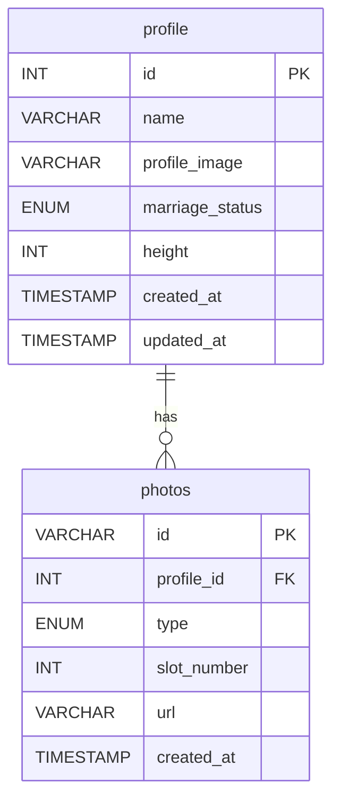

# C-Mate

매칭 서비스 마이페이지 프로젝트 — 프로필 보기/수정, 사진 관리 기능

## 기술 스택

| 영역     | 기술                             |
| -------- | -------------------------------- |
| Frontend | Next.js (App Router, TypeScript) |
| Backend  | Node.js, Express, TypeScript     |
| Database | MySQL 8.0                        |

## 실행 방법

```bash
# 기본 실행
docker compose down -v && docker compose up --build

# 접속
http://localhost:3000
```

종료: `Ctrl+C` 또는 `docker compose down`

초기 시드 데이터까지 포함해 처음 상태로 다시 올릴 때도 같은 명령을 사용합니다.

## 참고

- 기본 시드 프로필은 `profile.id = 1` 기준으로 생성됩니다.
- 초기 메인/서브/포토북 이미지는 `backend/src/uploads/1` 아래 시드 이미지로 제공됩니다.
- 프론트는 `next.config.mjs`를 통해 `/api/*`, `/uploads/*` 요청을 백엔드 컨테이너로 프록시합니다.

## 디자인 시스템

이 프로젝트는 피그마 기준 디자인 시스템을 Tailwind 토큰과 공용 컴포넌트로 적용했습니다.

- 토큰 정의: `frontend/src/app/globals.css`
- 공용 컴포넌트: `frontend/src/components/ui`

적용 범위:

- Typography: `Dp`, `H1`, `H2`, `B1`, `B2`, `b1`, `b2`, `b3`
- Color: `primary`, `sub-green`, `sub-red`, `sub-orange`, `gray-black`, `gray-1` ~ `gray-6`
- UI: 버튼, 입력창, 텍스트 영역, 라디오, 체크박스, 라벨, 셀렉트, 하단 탭바, 상단 네비, 섹션 타이틀

구현 원칙:

- 화면에서 직접 스타일을 반복 정의하지 않고 공용 컴포넌트와 토큰을 우선 사용합니다.
- 프로필 수정처럼 도메인 성격이 강한 UI는 `components/profile-edit` 아래에 별도 컴포넌트로 관리합니다.

## 프로젝트 구조

```
c-mate/
├── docker-compose.yml
├── frontend/                # Next.js
│   ├── src/
│   │   ├── app/             # 페이지, 레이아웃, 글로벌 스타일
│   │   ├── assets/          # 아이콘, 이미지 에셋
│   │   ├── components/      # 공용/도메인 UI 컴포넌트
│   │   ├── features/        # 화면 도메인별 상수, 데이터, 유틸
│   │   ├── hooks/           # React Query 등 커스텀 훅
│   │   ├── lib/             # API 클라이언트, Provider
│   │   ├── stores/          # zustand 상태 저장소
│   │   └── types/           # 공용 타입 정의
│   └── next.config.mjs      # API 프록시 설정
├── backend/                 # Express
│   └── src/
│       ├── controllers/     # 비즈니스 로직
│       ├── routes/          # API 라우트
│       ├── db/              # MySQL 연결, init.sql, migration
│       ├── middleware/      # multer (이미지 업로드)
│       ├── uploads/         # 이미지 저장소 (유저별 폴더)
│       └── utils/           # 업로드 경로 등 공용 유틸
└── _docs/                   # 설계 히스토리
```

## ERD

현재 스키마는 `backend/src/db/init.sql`과 `backend/src/db/migrate.ts` 기준입니다.



### `profile`

| 컬럼              | 타입                             | 설명                   |
| ----------------- | -------------------------------- | ---------------------- |
| `id`              | `INT`                            | 프로필 PK              |
| `name`            | `VARCHAR(50)`                    | 이름                   |
| `profile_image`   | `VARCHAR(255)`                   | 메인 프로필 이미지 URL |
| `marriage_status` | `ENUM('초혼', '재혼', '사실혼')` | 결혼 여부              |
| `height`          | `INT`                            | 신장(cm)               |
| `created_at`      | `TIMESTAMP`                      | 생성 시각              |
| `updated_at`      | `TIMESTAMP`                      | 수정 시각              |

### `photos`

| 컬럼          | 타입                       | 설명                      |
| ------------- | -------------------------- | ------------------------- |
| `id`          | `VARCHAR(36)`              | 사진 PK(UUID)             |
| `profile_id`  | `INT`                      | `profile.id` FK           |
| `type`        | `ENUM('sub', 'photobook')` | 서브 프로필 / 포토북 구분 |
| `slot_number` | `INT`                      | 슬롯 번호                 |
| `url`         | `VARCHAR(255)`             | 업로드 이미지 URL         |
| `created_at`  | `TIMESTAMP`                | 생성 시각                 |

### 제약 조건

- `photos.profile_id` -> `profile.id`
- `FOREIGN KEY (profile_id) REFERENCES profile(id) ON DELETE CASCADE`
- `UNIQUE KEY uniq_profile_photo_slot (profile_id, type, slot_number)`

같은 프로필 안에서 같은 `type`과 `slot_number` 조합은 1개만 존재합니다.

- 서브 프로필: `type = 'sub'`, `slot_number = 1..4`
- 포토북: `type = 'photobook'`, `slot_number = 1..10`

### 시드 데이터

- 기본 시드 프로필은 `profile.id = 1`
- 메인 이미지: `/uploads/1/seed-profile-main.jpg`
- 서브 이미지: `/uploads/1/seed-sub-01.jpg`, `/uploads/1/seed-sub-02.jpg`
- 포토북 이미지: `/uploads/1/seed-photobook-01.jpg`

### 런타임 메모

- 업로드 파일은 백엔드 컨테이너의 `/app/uploads` 경로를 사용합니다.
- 실제 URL은 `/uploads/:userId/:filename` 형태로 저장됩니다.
- `migrate.ts`는 기존 데이터가 있어도 `marriage_status`, `slot_number`, 시드 이미지 경로를 현재 스키마에 맞게 보정합니다.
